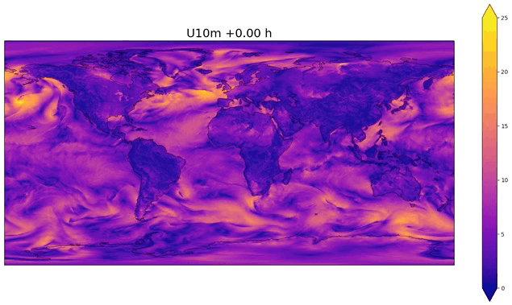

# Earth-2 Temporal Interpolation Model

The temporal interpolation model is used to increase the temporal resolution of AI-based
forecast models. These typically have a native temporal resolution of six hours; the
interpolation allows this to be improved to one hour. With appropriate training data, even
higher temporal resolutions might be achievable.

This PhysicsNeMo example shows how to train a ModAFNO-based temporal interpolation model
with a custom dataset. This architecture uses an embedding network to determine
parameters for a shift and scale operation that is used to modify the behavior of the AFNO
network depending on a given conditioning variable. For temporal
interpolation, the atmospheric states at both ends of the interpolation interval are
passed as inputs along with some auxiliary data, such as orography, and the conditioning
indicates which time step between the endpoints will be generated by the model. The
interpolation is deterministic and trained with a latitude-weighted L2 loss. However, it
can still be used to produce probabilistic forecasts, if used to interpolate results of
probabilistic forecast models. More formally, the ModAFNO $f_{\theta}$ is a conditional
expected-value model that approximates:

$$
f_{\theta} (x_{t}, x_{t+T}, \Delta t) \approx
\mathbb{E} \left[ x_{t + \Delta t} | x_{t}, x_{t+T}, \Delta t \right]
$$

$0 \leq \Delta t \leq T$. In the pre-trained model, $T = 6$ hours and
$\Delta t \in \{0, 1, 2, 3, 4, 5, 6\}$ hours.

For access to the pre-trained model, refer to the [wrapper in
Earth2Studio](https://nvidia.github.io/earth2studio/modules/generated/models/px/earth2studio.models.px.InterpModAFNO.html#earth2studio.models.px.InterpModAFNO).
A technical description of the model can be found in the paper ["Modulated Adaptive
Fourier Neural Operators for Temporal Interpolation of Weather
Forecasts"](https://arxiv.org/abs/2410.18904).



## Requirements

### Environment

You must have PhysicsNeMo installed on a GPU system. Training useful models, in
practice, requires a multi-GPU system; for the original model, 64 H100 GPUs were used.
Using the [PhysicsNeMo
container](https://catalog.ngc.nvidia.com/orgs/nvidia/teams/physicsnemo/containers/physicsnemo)
is recommended.

Install the additional packages (MLFlow) needed by this example:

```bash
pip install -r requirements.txt
```

### Data

To train a temporal interpolation model, ensure you have the following:

* A dataset of yearly HDF5 files at one-hour resolution. For more details, refer to the
  section ["Data Format and Structure" in the diagnostic model
  example](https://github.com/NVIDIA/physicsnemo/blob/5a64525c40eada2248cd3eacee0a6ac4735ae380/examples/weather/diagnostic/README.md#data-format-and-structure).
  These datasets can be very large. The dataset used to train the original model, with
  73 variables from 1980 to 2017, is approximately 100 TB in size. The data used to
  train the original model are on the ERA5 0.25 degree grid with shape `(721, 1440)` but
  other resolutions can work too. The ERA5 data is freely accessible; a recommended
  method to download it is the [ERA5 interface in
  Earth2Studio](https://nvidia.github.io/earth2studio/modules/generated/data/earth2studio.data.CDS.html).
  The data downloaded from this interface must then be inserted into the HDF5 file.
* Statistics files containing the mean and standard deviation of each channel in the
  data files. They must be in the `stats/global_means.npy` and
  `stats/global_stds.npy` files in your data directory. They must be `.npy` files
  containing a 1D array with length equal to the number of variables in the dataset,
  with each value giving the mean (for `global_means.npy`) or standard deviation (for
  `global_stds.npy`) of the corresponding variable.
* A JSON file with metadata about the contents of the HDF5 files. Refer to the [data
  sample](https://github.com/NVIDIA/physicsnemo/blob/main/examples/weather/temporal_interpolation/data/data.json)
  for an example describing the dataset used to train the original model.
* Optional: NetCDF4 files containing the orography and land-sea mask for the grid
  contained in the data. These should contain a variable of the same shape as the data.

## Configuration

The model training is controlled by YAML configuration files that are managed by
[Hydra](https://hydra.cc/), which is found in the `config` directory. The full
configuration for training of the original model is
[`train_interp.yaml`](https://github.com/NVIDIA/physicsnemo/blob/main/examples/weather/temporal_interpolation/config/train_interp.yaml).
[`train_interp_lite.yaml`](https://github.com/NVIDIA/physicsnemo/blob/main/examples/weather/temporal_interpolation/config/train_interp_lite.yaml)
runs a short test with a lightweight model, which is not expected to produce useful
checkpoints but can be used to verify that training runs without errors.

See the comments in the configuration files for an explanation of each configuration
parameter. To replicate the model from the paper, you only need to change the file and
directory paths to correspond to those on your system. If you train it with a custom
dataset, you might also need to change the `model.in_channels` and `model.out_channels`
parameters.

## Starting Training

Test the training by running the `train.py` script using the "lite" configuration file
on a system with a GPU:

```bash
python train.py --config-name=train_interp_lite.yaml
```

For a multi-GPU or multi-node training job, launch the training with the
`train_interp.yaml` configuration file using `torchrun` or MPI. For example, to train on
eight nodes with eight GPUs each, for a total of 64 GPUs, start a distributed compute
job (for example, using SLURM or Run:ai) and use:

```bash
torchrun --nnodes=8 --nproc-per-node=8 train.py --config-name=train_interp.yaml
```

Or the equivalent `mpirun` command. The code will automatically use all GPUs
available to the job. Remember to set `training.batch_size` in the configuration file to
the batch size *per process*.

Configuration parameters can be overridden from the command line using the Hydra syntax.
For instance, to set the optimizer learning rate to 0.0001 for the current run, you
can use:

```bash
torchrun --nnodes=8 --nproc-per-node=8 train.py --config-name=train_interp.yaml ++training.optimizer_params.lr=0.0001
```

## Validation

To evaluate checkpoints, you can use the `validate.py` script. The script computes a
histogram of squared errors as a function of the interpolation step (+0 h to +6 h),
which can be used to produce a plot similar to Figure 3 of the paper. The validation
uses the same configuration files as training, with validation-specific options passed
through the `validation` configuration group. Refer to the docstring of `error_by_time`
in `validate.py` for the recognized options.

For example, to run the validation of a model trained with `train_interp.yaml` and save
the resulting error histogram to `validation.nc`:

```bash
python validate.py --config-name="train_interp" ++validation.output_path=validation.nc
```
